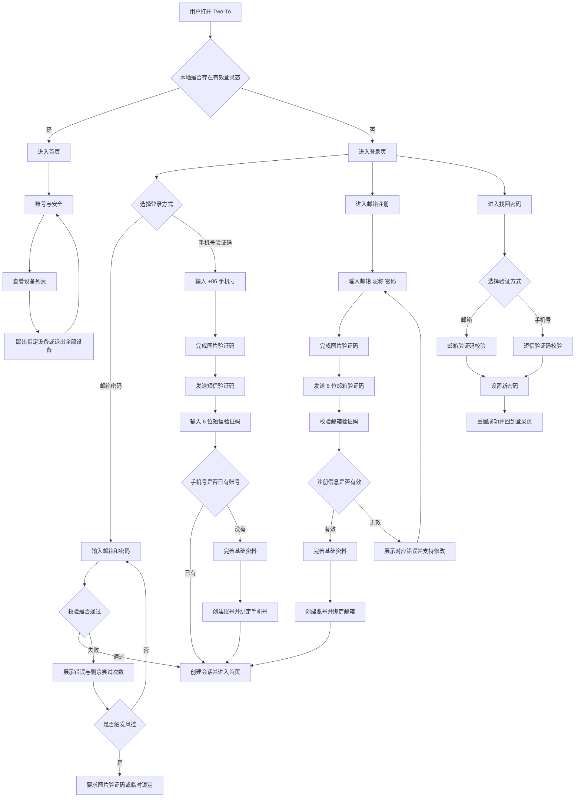
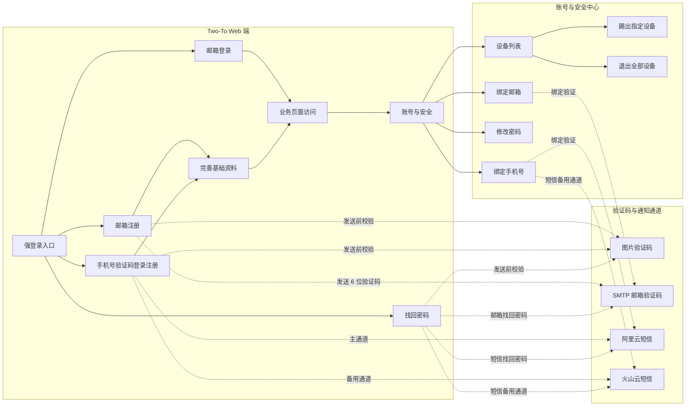

【需求】登录与注册账号体系

|**版本**|**修订日期**|**修订人**|**修订内容**|
|-|-|-|-|
|V1.0|2026-06-15|Codex|初稿，明确登录注册、验证码、安全中心、多设备管理和全站强登录范围|
|V1.1|2026-06-15|Codex|补充登录入口结构、敏感操作二次验证、验证码模板和技术评估结论|

## 一、需求背景

Two-To 当前已经完成 Web 端基础工程、首页、适配测评、品种解析、宠物档案等页面骨架，但还没有账号体系。随着后续测评结果、宠物档案、健康照料、成长记录等功能逐步上线，系统需要先建立稳定的用户身份、登录态和数据归属能力，否则用户产生的数据无法长期保存，也无法做跨设备访问和安全管理。

本次需求的核心目标是补齐 Two-To 的基础账号能力，让用户进入产品后先完成登录或注册，再进入业务页面。首期需要同时支持邮箱账号和中国大陆手机号账号，覆盖注册、登录、找回密码、验证码防刷、登录失败限制、刷新登录态、多设备管理等完整闭环。

账号体系属于后续所有业务模块的基础设施。本期不仅要让用户“能登录”，还要保证账号创建、验证码发送、密码存储、会话刷新、设备踢出等关键环节有清晰规则，避免后续宠物档案、测评结果、健康数据接入时返工。

## 二、相关调研

### 2.1 微信 / 主流手机号登录产品

**核心设计**

- 手机号验证码登录注册一体，用户输入手机号和验证码后直接进入产品，新手机号再补充必要资料。

**对我们的参考价值**

- Two-To 首期手机号入口采用登录注册一体，降低用户判断“登录还是注册”的成本。

**不适合直接借鉴的地方**

- 微信依托自有账号生态和强风控能力，Two-To 首期不做复杂社交身份、实名、通讯录等能力。

### 2.2 GitHub / 主流邮箱账号产品

**核心设计**

- 邮箱 + 密码是稳定账号入口，邮箱验证用于确认账号归属，设备和会话可在安全设置中管理。

**对我们的参考价值**

- Two-To 邮箱入口保留注册、登录、找回密码、安全中心等清晰路径。

**不适合直接借鉴的地方**

- GitHub 面向开发者，有较重的 MFA、SSH Key、Token 管理等安全能力，首期不照搬高门槛设置。

### 2.3 阿里云短信 / 火山云短信

**核心设计**

- 短信发送依赖签名、模板、AccessKey、区域、回执等配置，接口错误可分为业务失败和通道异常。

**对我们的参考价值**

- Two-To 短信服务做成可配置供应商，首期支持阿里云和火山云，并支持主备切换。

**不适合直接借鉴的地方**

- 不同云厂商接口和错误码不一致，产品层不暴露供应商差异，用户只感知“发送成功 / 发送失败 / 稍后重试”。

### 2.4 OWASP / NIST 账号安全建议

**核心设计**

- 密码安全、验证码限频、登录失败限制、找回密码防枚举、会话失效是账号体系的基础安全要求。

**对我们的参考价值**

- Two-To 首期明确密码强度、验证码有效期、发送频控、失败锁定、刷新 token、退出设备等规则。

**不适合直接借鉴的地方**

- 安全规范覆盖企业级复杂场景，Two-To 首期不做过重的企业风控、强制 MFA、国际化身份认证。

## 三、概要设计

### 3.1 用户体验流程图



### 3.2 产品功能架构图



### 3.3 版本规划

* **1.0 版本（本期 MVP）**
  * 全站强登录，未登录用户统一进入登录/注册流程。
  * 支持邮箱注册、邮箱密码登录、手机号验证码登录注册一体。
  * 支持新用户完善基础资料，沉淀后续适配推荐所需的轻量用户画像。
  * 支持图片验证码、短信验证码、邮箱验证码、找回密码。
  * 支持阿里云和火山云短信供应商配置，支持主备通道。
  * 支持 SMTP 邮箱验证码发送。
  * 支持账号与安全中心，包含绑定邮箱/手机号、修改密码、设备列表、踢出指定设备、退出全部设备。
  * 支持 access token + refresh token 会话刷新和设备级失效。
  * 终端：Two-To Web 端。

* **2.0 版本（优化迭代）**
  * 增加第三方登录，例如微信、Apple、Google。
  * 增加账号注销、账号数据导出、账号合并申诉。
  * 增加更细的风险策略，例如异地登录提醒、敏感操作二次验证、短信费用看板。
  * 增加国际手机号和多语言验证码模板。

* **3.0 版本（长期规划）**
  * 支持家庭协作账号体系，围绕同一宠物档案建立家庭成员身份和权限。
  * 支持 Passkey / 生物识别等免密码登录能力。
  * 支持更完整的安全审计、异常登录通知和账号保护策略。

## 四、产品详细设计

### 4.1 功能列表

|**功能模块**|**是否纳入本期**|**说明**|
|-|-|-|
|全站强登录|✅|用户进入 Two-To 后必须先登录或注册，业务页面和业务接口均要求登录态。|
|邮箱注册|✅|邮箱、6 位邮箱验证码、密码、昵称创建账号。|
|邮箱密码登录|✅|已注册邮箱用户通过邮箱和密码登录。|
|手机号验证码登录注册一体|✅|仅支持中国大陆 +86 手机号；手机号已存在则登录，不存在则完善基础资料后创建账号。|
|图片验证码|✅|发送短信/邮箱验证码前必过，高风险登录场景可再次要求。|
|短信验证码|✅|真实接入阿里云、火山云，支持主备通道配置。|
|邮箱验证码|✅|使用 SMTP 发送 6 位验证码。|
|忘记密码|✅|通过绑定邮箱或绑定手机号校验后重置密码。|
|账号与安全中心|✅|管理邮箱、手机号、密码、登录设备和退出登录。|
|多设备管理|✅|查看设备列表，踢出指定设备，退出全部设备。|
|登录失败限制|✅|连续失败后要求图片验证码，达到阈值后临时锁定。|
|刷新 token|✅|支持登录态静默刷新，设备被踢出后刷新失败并回到登录页。|
|完善基础资料|✅|新用户注册后填写昵称、养宠阶段、感兴趣宠物类型等轻量画像字段。|
|第三方登录|❌|2.0 版本扩展。|
|国际手机号|❌|2.0 版本扩展，本期仅 +86。|
|强制 MFA / Passkey|❌|3.0 版本扩展，本期不提高首登门槛。|
|游客模式|❌|本期不做，产品入口强制登录。|

### 4.2 功能详情

#### 4.2.1 全站强登录✅

**访问规则**

- 用户打开 Two-To 任意业务页面时，系统先判断本地是否存在有效登录态。
- 已登录：进入目标页面。
- 未登录：跳转到登录页，并记录原目标路径，登录成功后回到原目标路径；原目标路径不可用时回到首页。

**开放页面**

- 登录页、注册页、找回密码页、验证码刷新/发送相关接口允许未登录访问。
- 首页、适配测评、品种解析、宠物档案、后续健康照料和成长记录页面均要求登录。

**特殊情况说明**

- 登录态过期：页面弹出过期提示，清理本地登录态后跳转登录页。
- refresh token 失效：不再重复刷新，直接要求重新登录。
- 被其他设备踢出：提示“当前设备登录已失效，请重新登录”。

**图示**

- 流程图一：登录注册账号体系主流程。

#### 4.2.2 邮箱注册✅

**表单字段**

- 邮箱：必填，校验邮箱格式。
- 密码：必填，8-64 位，允许字母、数字、符号，不强制大小写组合。
- 邮箱验证码：6 位数字，发送前必须先完成图片验证码。

**业务规则**

- 邮箱验证码校验通过后，进入完善基础资料流程。
- 完善基础资料提交成功后创建账号，并默认绑定邮箱，满足“至少绑定一种联系方式”的账号规则。
- 邮箱验证码有效期 10 分钟，同一验证码成功使用后立即失效。
- 同一邮箱已注册时，提示用户直接登录或找回密码。

**特殊情况说明**

- 邮箱验证码错误：提示验证码错误，不清空邮箱和密码。
- 邮箱验证码过期：提示重新获取验证码。
- SMTP 发送失败：提示“验证码发送失败，请稍后重试”，不暴露 SMTP 错误详情。

#### 4.2.3 邮箱密码登录✅

**表单字段**

- 邮箱：必填，校验邮箱格式。
- 密码：必填。

**业务规则**

- 登录成功后创建当前设备会话，进入首页或登录前目标路径。
- 邮箱和密码错误统一提示“账号或密码不正确”，避免暴露邮箱是否存在。
- 用户可从登录页进入找回密码。

**登录失败限制**

- 同一邮箱连续失败 5 次后，下一次登录必须完成图片验证码。
- 同一邮箱连续失败 10 次后，临时锁定 15 分钟。
- 锁定期内继续提交登录，提示稍后再试，不校验密码。

**特殊情况说明**

- 账号被禁用：提示“账号状态异常，请联系管理员”。
- 密码重置后：历史 refresh token 全部失效，已登录设备需要重新登录。

#### 4.2.4 手机号验证码登录注册一体✅

**表单字段**

- 手机号：仅支持中国大陆 +86 手机号，按 11 位大陆手机号格式校验。
- 图片验证码：发送短信验证码前必填。
- 短信验证码：6 位数字。

**业务规则**

- 手机号已绑定账号：验证码校验通过后直接登录。
- 手机号未绑定账号：验证码校验通过后进入完善基础资料流程，提交成功后创建账号并绑定手机号。
- 手机号注册账号默认绑定手机号，满足“至少绑定一种联系方式”的账号规则。
- 手机号入口不要求用户先选择“登录”或“注册”。

**特殊情况说明**

- 手机号格式错误：前端直接提示格式不正确。
- 短信验证码错误：提示验证码错误，不清空手机号。
- 验证码过期：提示重新获取验证码。
- 完善基础资料中途退出：不创建账号，用户下次验证手机号后重新进入完善基础资料。

#### 4.2.5 完善基础资料✅

**入口**

- 手机号新用户：短信验证码校验通过且手机号未绑定账号时进入。
- 邮箱新用户：邮箱验证码校验通过且邮箱未绑定账号时进入。
- 该流程是新用户创建账号前的最后一步。

**必填字段**

- 昵称：2-20 个字符，允许重复，系统内部以用户 ID 区分用户。
- 养宠阶段：单选，选项为“正在考虑养宠 / 已经在养宠 / 已经养宠，也想再了解适配建议 / 暂时只是了解”。
- 感兴趣的宠物类型：多选，选项为“猫 / 狗 / 兔 / 仓鼠 / 鸟类 / 鱼 / 龟 / 爬宠 / 还不确定”。

**选填字段**

- 养宠经验：单选，选项为“新手 / 养过宠物 / 正在养宠 / 有多宠经验”。
- 每日可陪伴时间：单选，选项为“30 分钟以内 / 30 分钟 - 1 小时 / 1 - 2 小时 / 2 小时以上 / 暂不确定”。
- 居住情况：单选，选项为“独居 / 和家人同住 / 合租 / 学生宿舍或集体居住 / 暂不方便说明”。
- 养宠限制：多选，选项为“住所不确定是否允许养宠 / 家里有人过敏 / 家里有老人或小孩 / 经常出差或不在家 / 预算有限 / 暂无明显限制”。

**业务规则**

- 必填字段提交后才创建账号。
- 选填字段可以跳过，跳过后仍可创建账号。
- 完善基础资料凭证有效期 10 分钟，过期后需要重新完成邮箱或手机号验证码校验。
- 提交成功后，系统保存轻量用户画像，用于后续首页内容推荐、品种内容排序和适配测评预填。

**不前置收集的字段**

- 不收集真实姓名。
- 不收集性别。
- 不收集生日。
- 不收集详细地址。
- 不收集收入、身份证或实名信息。

**特殊情况说明**

- 用户中途返回登录页：不创建账号。
- 凭证过期：提示“验证已过期，请重新验证”，并返回对应注册/登录入口。
- 选填字段未填写：提交时不阻塞，后续可在个人资料或适配测评中补充。

#### 4.2.6 图片验证码✅

**使用场景**

- 发送短信验证码前必须完成图片验证码。
- 发送邮箱验证码前必须完成图片验证码。
- 邮箱密码登录连续失败达到风控阈值后，要求完成图片验证码。

**规则**

- 图片验证码有效期 5 分钟。
- 同一图片验证码最多允许错误 5 次，超过后失效，需要刷新。
- 图片验证码成功用于一次验证码发送后立即失效。

**体验要求**

- 支持点击图片刷新。
- 看不清时提供“换一张”入口。
- 错误时只刷新验证码，不清空手机号/邮箱等已输入字段。

#### 4.2.7 短信验证码✅

**供应商配置**

- 首期支持阿里云和火山云短信。
- 支持配置主通道和备用通道，例如主通道阿里云、备用通道火山云。
- 短信签名、模板 ID、AccessKey、区域等信息通过配置维护。

**发送规则**

- 验证码为 6 位数字，有效期 10 分钟。
- 同一手机号同一用途 60 秒内不能重复发送。
- 同一手机号同一用途 1 小时最多发送 5 次，1 天最多发送 10 次。
- 同一 IP 1 小时最多触发 30 次短信发送。

**主备切换**

- 主通道服务异常、网络超时、供应商不可用时，允许切换备用通道发送。
- 手机号格式错误、模板未审核、签名错误、频控命中、余额不足等明确业务失败不自动切换，避免重复扣费和重复下发。

**特殊情况说明**

- 供应商均不可用：提示“验证码发送失败，请稍后重试”。
- 用户频繁请求：提示“发送过于频繁，请稍后再试”。
- 阿里云和火山云错误码需要归一为“可重试通道异常 / 不可重试业务失败 / 配置错误”三类。

#### 4.2.8 邮箱验证码✅

**发送方式**

- 使用 SMTP 配置发送 6 位数字验证码。
- 邮件内容包含验证码、有效期、用途说明和非本人操作提示。

**发送规则**

- 验证码有效期 10 分钟，成功使用后立即失效。
- 同一邮箱同一用途 60 秒内不能重复发送。
- 同一邮箱同一用途 1 小时最多发送 5 次，1 天最多发送 10 次。
- 同一 IP 1 小时最多触发 30 次邮箱验证码发送。

**特殊情况说明**

- 邮箱不存在或未注册时，找回密码场景仍展示统一提示，避免暴露账号是否存在。
- SMTP 配置异常：提示发送失败，服务日志记录配置错误摘要，不向用户展示内部信息。
- 发件人名称使用“Two-To”。
- 邮箱主题使用“Two-To 验证码”。
- 邮件模板使用文本格式，正文包含验证码、有效期、非本人操作提示。

#### 4.2.9 忘记密码✅

**入口**

- 登录页提供“忘记密码”。
- 用户可选择邮箱验证码或手机号验证码找回。

**验证规则**

- 邮箱找回：邮箱必须已绑定账号，校验 6 位邮箱验证码后进入重置密码。
- 手机号找回：手机号必须已绑定账号，校验 6 位短信验证码后进入重置密码。
- 发送验证码前必须完成图片验证码。

**重置规则**

- 新密码必须符合密码规则，且不能与当前密码相同。
- 重置成功后，当前账号所有历史 refresh token 失效。
- 用户回到登录页，用新密码重新登录。

**防枚举规则**

- 无论邮箱/手机号是否存在，发送请求的用户提示统一为“如果账号存在，验证码将发送到对应联系方式”。
- 实际不存在账号时不发送验证码。

#### 4.2.10 账号与安全中心✅

**入口**

- 登录后用户可从全局导航或个人菜单进入“账号与安全”。

**基础信息**

- 展示昵称、用户 ID 摘要、绑定邮箱、绑定手机号。
- 昵称允许修改，仍允许重复。

**联系方式管理**

- 绑定邮箱：输入邮箱，完成图片验证码和邮箱验证码后绑定。
- 绑定手机号：输入 +86 手机号，完成图片验证码和短信验证码后绑定。
- 修改绑定：新联系方式验证通过后替换原联系方式。
- 解绑限制：账号必须至少保留邮箱或手机号一种联系方式。

**特殊情况说明**

- 新邮箱/手机号已绑定其他账号：提示该联系方式已被使用，不允许绑定。
- 解绑最后一种联系方式：禁止操作，并提示至少保留一种联系方式。
- 修改密码必须输入当前密码。
- 解绑邮箱/手机号前要求当前密码。
- 修改绑定邮箱/手机号只验证新联系方式，不要求当前密码。

#### 4.2.11 修改密码✅

**入口**

- 账号与安全中心提供“修改密码”。

**规则**

- 已登录用户修改密码，需要输入当前密码和新密码。
- 新密码 8-64 位，允许字母、数字、符号，不强制大小写组合。
- 禁止纯空格、常见弱密码、与邮箱/手机号明显相同的密码。
- 修改成功后，除当前设备外的其他设备 refresh token 失效。

**特殊情况说明**

- 当前密码错误：提示当前密码不正确，并计入敏感操作失败次数。
- 新密码与旧密码相同：提示不能与当前密码相同。
- 用户忘记当前密码：引导走找回密码流程。

#### 4.2.12 多设备管理✅

**设备列表展示**

- 展示当前账号已登录设备列表。
- 每台设备展示设备名称、浏览器/系统摘要、登录时间、最近活跃时间、IP/地区摘要。
- 当前设备展示“当前设备”标识。

**设备操作**

- 踢出指定设备：用户可让某台非当前设备失效。
- 退出全部设备：用户可让除当前操作链路外的全部设备失效，并重新登录。
- 当前设备可执行退出登录。

**失效规则**

- 被踢出设备的 refresh token 立即失效。
- 被踢出设备若 access token 尚未过期，最多在 access token 有效期内仍可能短暂访问；下一次刷新或过期后必须重新登录。

**特殊情况说明**

- 设备信息无法识别：展示“未知设备”。
- 地区信息无法识别：展示“未知地区”。
- 本期只展示 IP 摘要和设备信息，不做地区解析。

#### 4.2.13 会话与 token✅

**登录态结构**

- 登录成功后生成 access token 和 refresh token。
- access token 用于访问业务接口，refresh token 用于静默刷新登录态。

**默认有效期**

- access token 默认有效期 15 分钟。
- refresh token 默认有效期 30 天。
- refresh token 每次刷新后轮换，旧 refresh token 失效。

**退出规则**

- 退出登录：当前设备 refresh token 失效。
- 踢出设备：目标设备 refresh token 失效。
- 退出全部设备：账号下所有 refresh token 失效。

**特殊情况说明**

- refresh token 被重复使用：视为异常会话，当前设备重新登录；服务端记录安全日志。
- 服务端 token 存储只保留摘要，不保存明文 token。

#### 4.2.14 账号状态✅

**账号状态**

- 未登录：只能访问登录注册相关页面。
- 待完善资料：邮箱或手机号验证码通过但账号未创建，必须完成基础资料必填项后完成注册。
- 正常：可访问所有已上线业务页面。
- 临时锁定：因登录失败过多暂时限制登录。
- 禁用：账号不可登录，需联系管理员处理。

**状态流转**

- 邮箱注册成功：正常。
- 手机号验证码通过且完善基础资料成功：正常。
- 登录失败达到阈值：临时锁定。
- 临时锁定到期：恢复正常登录尝试。
- 管理员禁用：禁用。

**特殊情况说明**

- 禁用账号不可通过找回密码恢复。
- 临时锁定只影响登录，不影响已登录设备的会话。
- 高风险登录本期只记录安全日志，不自动失效全部会话。

### 4.3 页面与入口

|**页面**|**主要内容**|**访问权限**|**完成后去向**|
|-|-|-|-|
|登录页|邮箱密码登录、手机号验证码登录、注册入口、找回密码入口|未登录可访问|登录成功后进入首页或原目标路径|
|邮箱注册页|邮箱、密码、图片验证码、邮箱验证码|未登录可访问|验证码校验通过后进入完善基础资料|
|完善基础资料页|昵称、养宠阶段、感兴趣宠物类型、选填画像字段|未登录可访问，但必须带邮箱或手机号验证通过凭证|创建账号后自动登录并进入首页|
|找回密码页|邮箱/手机号选择、图片验证码、6 位验证码、新密码|未登录可访问|重置成功后回到登录页|
|账号与安全页|昵称、绑定邮箱/手机号、修改密码、设备管理|登录后可访问|操作成功后留在当前页|

### 4.4 入口与敏感操作规则

#### 4.4.1 登录入口结构

- 登录页是未登录用户的统一入口。
- 默认展示“手机号验证码登录”。
- 用户可通过 Tab 切换到“邮箱密码登录”。
- 邮箱注册从登录页进入独立注册页。
- 手机号注册不单独提供注册入口，统一走手机号验证码登录注册一体流程；手机号不存在时，验证码通过后进入完善基础资料。
- 用户打开 Two-To 后，如果未登录，直接进入登录页；登录页可承载 Two-To Logo 和品牌文案，但不额外增加游客首页或欢迎页。

#### 4.4.2 页面状态规则

**登录页**

- 默认展示“手机号验证码登录”。
- 手机号登录流程：输入手机号 -> 输入图片验证码 -> 获取短信验证码 -> 60 秒倒计时 -> 输入短信验证码 -> 登录或进入完善基础资料。
- 邮箱密码登录流程：输入邮箱和密码；连续失败达到阈值后，额外展示图片验证码。
- 所有错误提示展示在当前表单内，不使用全局弹窗。
- 登录成功后回到用户原本想访问的页面；没有原路径时进入首页。

**邮箱注册页**

- 一个页面完成邮箱、密码、确认密码、图片验证码、邮箱验证码。
- “获取邮箱验证码”按钮在邮箱格式正确、图片验证码通过后可用。
- 邮箱验证码通过后进入完善基础资料。
- 邮箱已注册时提示“该邮箱已注册，可直接登录或找回密码”。

**完善基础资料页**

- 必填字段：昵称、养宠阶段、感兴趣宠物类型。
- 选填字段：养宠经验、每日可陪伴时间、居住情况、养宠限制。
- 选填字段支持跳过。
- 完善基础资料凭证有效期 10 分钟；过期后回到对应登录/注册入口重新验证。
- 用户中途返回登录页，不创建账号。

**找回密码页**

- 使用三步流程：选择邮箱或手机号并发送验证码 -> 输入验证码 -> 设置新密码并确认密码。
- 密码重置成功后不自动登录，回到登录页，让用户用新密码登录。
- 找回密码时不提示账号是否存在，统一提示“如果账号存在，验证码将发送到对应联系方式”。

**账号与安全页**

- 分为基础资料、登录方式、密码安全、登录设备四个区块。
- 基础资料：修改昵称，直接保存。
- 登录方式：绑定或修改邮箱/手机号，使用弹窗或抽屉完成，不跳转新页面。
- 密码安全：修改密码。
- 登录设备：在当前页展示设备列表，不单独拆页面。

**页面级异常**

- 网络错误：保留已填写内容，提示“网络异常，请稍后重试”。
- 验证码发送失败：不清空表单，允许重试。
- 频控命中：验证码按钮禁用，并展示剩余等待时间。
- 会话过期：跳转登录页，提示“登录已过期，请重新登录”。
- 被踢出设备：跳转登录页，提示“当前设备登录已失效”。

#### 4.4.3 敏感操作二次验证

- 修改密码：必须输入当前密码。
- 修改绑定邮箱：验证新邮箱验证码即可，不要求旧邮箱验证码。
- 修改绑定手机号：验证新手机号短信验证码即可，不要求旧手机号验证码。
- 解绑邮箱/手机号：只有账号还保留另一种联系方式时允许；解绑前要求当前密码。
- 踢出指定设备：二次确认弹窗即可。
- 退出全部设备：二次确认弹窗 + 当前密码。
- 修改昵称：不需要二次验证。

#### 4.4.4 验证码模板

**短信验证码**

```text
【Two-To】验证码：123456，10分钟内有效。请勿转发给他人，如非本人操作请忽略。
```

**邮箱验证码主题**

```text
Two-To 验证码
```

**邮箱验证码正文**

```text
你的 Two-To 验证码是：123456

验证码 10 分钟内有效，请勿转发给他人。
如果这不是你本人操作，可以忽略这封邮件。
```

#### 4.4.5 技术评估结论

- 短信错误码归一：本期必须做，将阿里云和火山云错误统一归为“可重试通道异常 / 不可重试业务失败 / 配置错误”三类。
- IP 地区解析：本期先只展示 IP 摘要和设备信息，不做地区解析。
- 验证码/设备记录清理：本期做简单定时任务。
- 短信/SMTP 发送：本期同步返回发送结果，不先做异步队列。
- 高风险登录：本期不自动踢出全部设备，只记录安全日志。

#### 4.4.6 UI 设计范围页面清单

**登录页**

- Two-To 品牌区。
- 登录方式 Tab：手机号验证码 / 邮箱密码。
- 手机号表单：手机号、图片验证码、短信验证码。
- 邮箱表单：邮箱、密码；必要时出现图片验证码。
- 底部入口：邮箱注册、忘记密码。

**邮箱注册页**

- 邮箱、密码、确认密码。
- 图片验证码、邮箱验证码。
- 下一步进入完善基础资料。

**完善基础资料页**

- Step 1 必填：昵称、养宠阶段、感兴趣宠物类型。
- Step 2 选填：养宠经验、每日可陪伴时间、居住情况、养宠限制。
- 主按钮：完成并进入 Two-To。
- 选填部分提供“跳过”。

**找回密码页**

- Step 1：选择邮箱 / 手机号，输入账号，完成图片验证码并发送验证码。
- Step 2：输入 6 位验证码。
- Step 3：设置新密码、确认密码。
- 成功态：返回登录页。

**账号与安全页**

- 基础资料：昵称。
- 登录方式：邮箱、手机号。
- 密码安全：修改密码。
- 登录设备：设备列表、踢出设备、退出全部设备。

**通用弹窗 / 抽屉**

- 修改邮箱。
- 修改手机号。
- 修改密码。
- 解绑联系方式。
- 踢出设备确认。
- 退出全部设备确认。

### 4.5 边界确认清单

- ✅ Two-To Web 端本期必须登录后才能访问业务页面。
- ✅ 邮箱和手机号至少绑定一种，邮箱注册默认绑定邮箱，手机号注册默认绑定手机号。
- ✅ 昵称允许重复，系统内部用用户 ID 区分用户。
- ✅ 手机号仅支持中国大陆 +86。
- ✅ 短信真实接入阿里云和火山云，并支持配置主备。
- ✅ 邮箱验证码使用 SMTP。
- ✅ 支持设备列表、踢出指定设备、退出全部设备。
- ❌ 本期不做游客模式。
- ❌ 本期不做第三方登录。
- ❌ 本期不做国际手机号。
- ❌ 本期不自动合并邮箱账号和手机号账号；只有登录后主动绑定联系方式，才归属同一账号。

## 五、埋点需求

| **模块** | **埋点事件** | **触发时机** | **记录信息** | **分析意义** |
|-|-|-|-|-|
| 登录页 | 进入登录页 | 用户打开应用但未登录，或登录态失效跳转登录页 | 来源页面、是否携带原目标路径、登录态失效原因 | 判断强登录是否阻断过多用户，若登录页进入量高但完成率低，需要优化首屏登录体验。 |
| 邮箱密码登录 | 邮箱登录提交 | 用户点击邮箱登录按钮 | 登录结果、失败原因分类、是否触发图片验证码、是否命中锁定 | 分析邮箱登录成功率和失败原因，判断密码规则、错误提示和找回密码入口是否清晰。 |
| 手机号验证码登录 | 手机号登录提交 | 用户提交短信验证码 | 手机号是否已注册、登录/注册结果、短信供应商、失败原因 | 分析手机号入口的注册转化和登录成功率，判断短信通道质量和完善基础资料转化。 |
| 邮箱注册 | 邮箱注册完成 | 用户提交邮箱验证码并创建账号 | 注册结果、邮箱验证码发送次数、是否失败后重试 | 分析邮箱注册转化率，若验证码发送成功但注册低，说明邮件到达或表单体验可能有问题。 |
| 验证码发送 | 验证码发送请求 | 用户请求短信或邮箱验证码 | 验证码类型、用途、通道、发送结果、是否触发频控 | 分析短信/邮件成本、通道稳定性和风控阈值是否合理。 |
| 图片验证码 | 图片验证码校验 | 用户提交图片验证码 | 校验结果、用途、错误次数 | 判断图片验证码难度是否过高，错误率偏高时需要优化验证码可读性。 |
| 找回密码 | 密码重置完成 | 用户完成新密码设置 | 找回方式、验证码发送次数、重置结果 | 分析用户找回密码成功率，失败较高时排查验证码到达率或流程理解成本。 |
| 账号与安全 | 绑定联系方式完成 | 用户绑定或修改邮箱/手机号 | 联系方式类型、操作类型、结果、失败原因 | 判断用户是否愿意补齐安全联系方式，失败较高时优化验证流程。 |
| 多设备管理 | 设备管理操作 | 用户踢出设备、退出全部设备、退出当前设备 | 操作类型、设备数量、是否当前设备 | 判断安全中心使用频率和设备异常感知情况，为后续异地登录提醒提供依据。 |
| 会话刷新 | token 刷新结果 | 前端静默刷新登录态 | 刷新结果、失败原因、设备是否被踢出 | 判断登录态稳定性，刷新失败高说明会话策略或前端重试逻辑需要优化。 |

## 六、非功能需求

1. 响应速度
   - 登录、注册、找回密码等表单提交接口目标响应时间 P95 ≤ 500ms，不包含第三方短信/SMTP 网络耗时。
   - 图片验证码生成接口目标响应时间 P95 ≤ 300ms。
   - 账号与安全设备列表目标响应时间 P95 ≤ 500ms。

2. 第三方通道可用性
   - 短信发送支持主备供应商配置，主通道异常时自动尝试备用通道。
   - SMTP 发送失败需要有明确日志，用户侧只展示可理解失败提示。
   - 短信和 SMTP 发送本期同步返回发送结果，不先做异步队列。

3. 安全要求
   - 密码必须加盐哈希存储，不允许明文存储。
   - 验证码不保存明文，服务端仅保存验证码摘要、用途、过期时间、尝试次数和状态。
   - token 明文只返回给客户端，服务端只保存 refresh token 摘要。
   - 登录失败、验证码发送、找回密码、敏感操作都需要限频。
   - 错误提示避免暴露账号是否存在、验证码具体错误细节、供应商内部错误。

4. 隐私要求
   - 日志不打印完整手机号、邮箱、验证码、密码、token。
   - 设备列表展示手机号/邮箱时需要脱敏。
   - IP 和地区只用于安全提示和排查，不在普通页面暴露完整 IP。

5. 兼容要求
   - Web 端需适配桌面和移动端浏览器。
   - 登录页、注册页、找回密码页需要支持键盘操作和基础无障碍标签。
   - 网络异常时用户应看到明确失败提示，并保留已填写的非敏感字段。

6. 数据保留
   - 验证码记录建议保留 30 天用于风控排查，到期清理。
   - 登录设备记录建议保留 180 天，退出或失效设备仍可保留摘要记录用于安全审计。
   - 清理策略本期采用简单定时任务。

7. 内容合规
   - 本需求不涉及 AI 内容生成。
   - 短信和邮件模板需提前完成供应商审核，模板内容不得包含误导性承诺。

## 七、预估排期

QA：待定    UE：待定    UI：待定
后端：待定    前端：待定

|**角色**|**需求确认**|**UI/交互设计**|**前后端开发**|**联调测试**|**验收上线**|
|-|-|-|-|-|-|
|需求|1 天|||||
|UE/UI||2 天||||
|后端|||5-7 天|||
|前端|||4-6 天|||
|功能测试||||2-3 天||
|交付/上线|||||1 天|

**待技术评估：** 以上排期按单人/小团队早期项目估算，真实短信供应商开通、签名模板审核、SMTP 凭据准备不计入研发工时，需提前并行处理。
